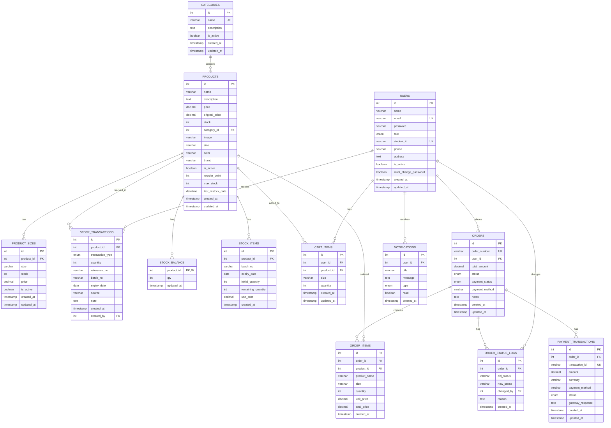
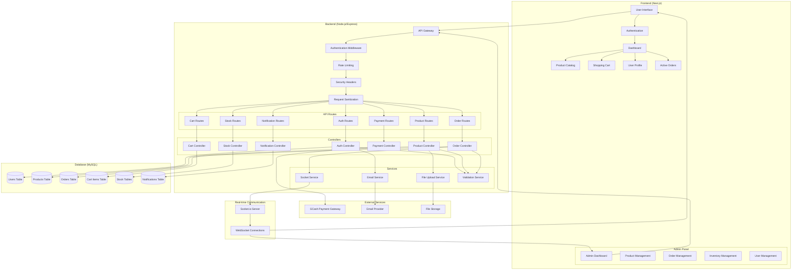
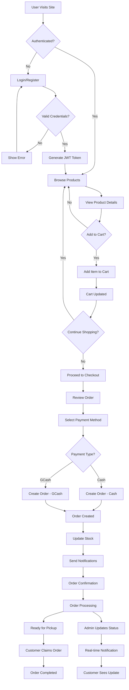
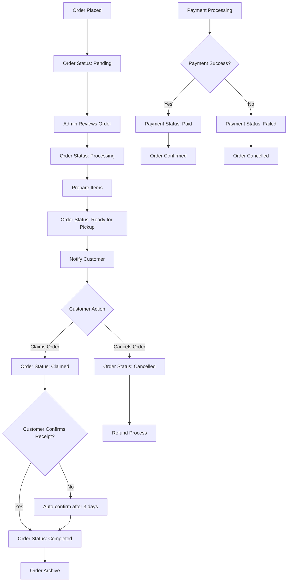
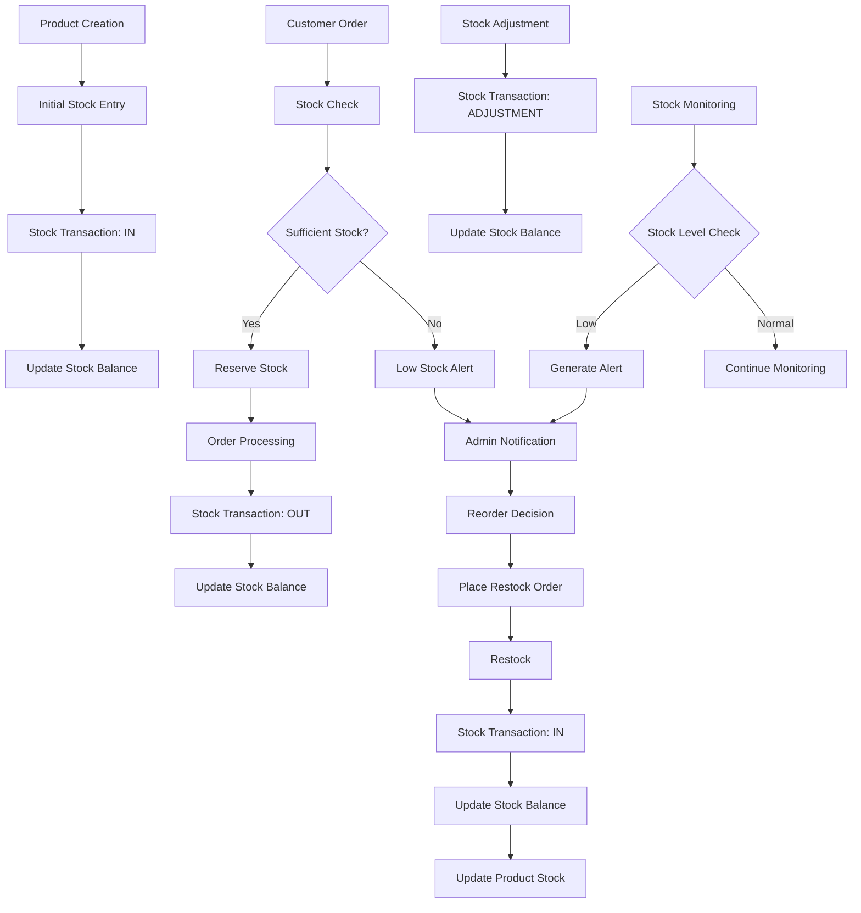
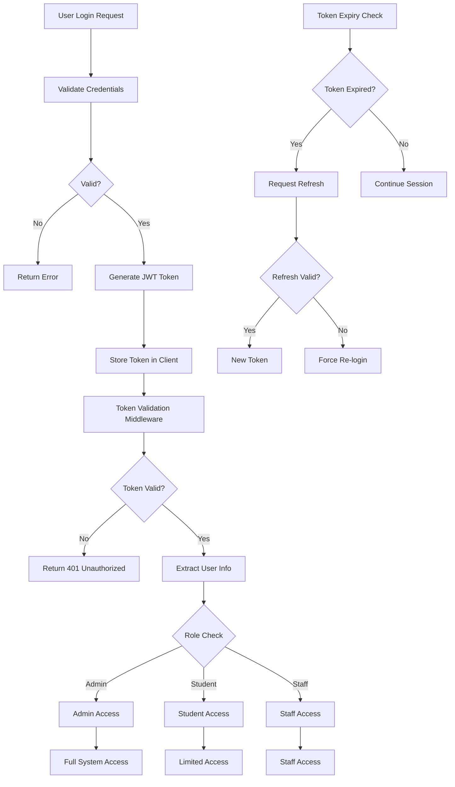
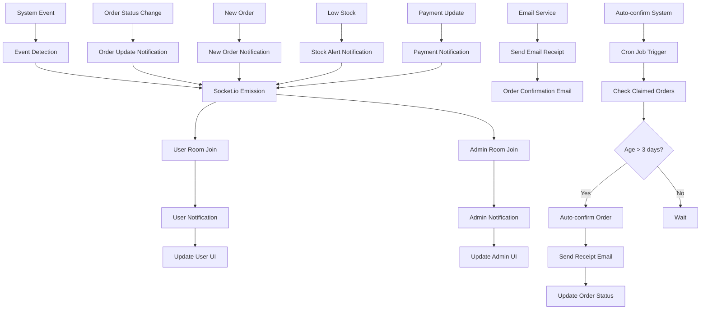
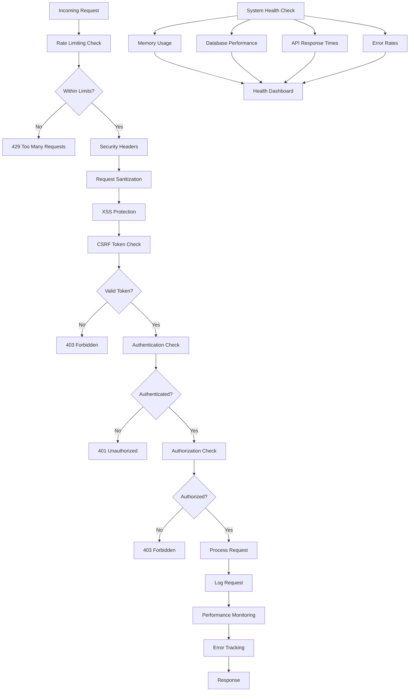
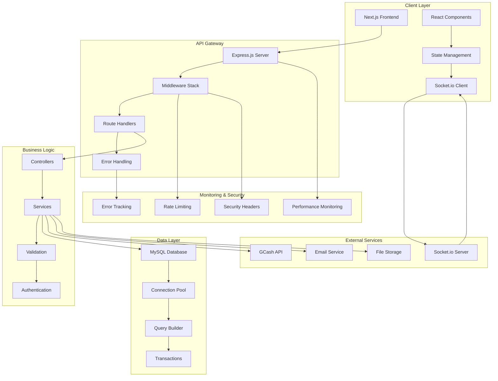

# 🏗️ CPC ESSEN CAPSTONE PROJECT - SYSTEM DIAGRAMS

## 📊 **ENTITY RELATIONSHIP DIAGRAM (ERD)**

## 🔄 **SYSTEM ARCHITECTURE FLOWCHART**

## 🛒 **E-COMMERCE USER FLOW**

## 📦 **ORDER MANAGEMENT FLOW**

## 🏪 **INVENTORY MANAGEMENT FLOW**

## 🔐 **AUTHENTICATION & AUTHORIZATION FLOW**

## 📊 **REAL-TIME NOTIFICATION SYSTEM**

## 🛡️ **SECURITY & MONITORING FLOW**

## 🔧 **SYSTEM INTEGRATION ARCHITECTURE**

---

## 📋 **DIAGRAM DESCRIPTIONS**

### **1. Entity Relationship Diagram (ERD)**
- Shows all database tables and their relationships
- Primary keys (PK), Foreign keys (FK), and Unique keys (UK)
- One-to-many and many-to-many relationships
- Complete data model for the e-commerce system

### **2. System Architecture Flowchart**
- High-level system components and their interactions
- Frontend, Backend, Database, and External Services
- Real-time communication flow
- Service-oriented architecture

### **3. E-Commerce User Flow**
- Complete customer journey from visit to order completion
- Authentication, product browsing, cart management
- Checkout process and payment handling
- Order tracking and completion

### **4. Order Management Flow**
- Order lifecycle from placement to completion
- Status transitions and admin actions
- Payment processing integration
- Auto-confirmation system

### **5. Inventory Management Flow**
- Stock tracking and management processes
- Stock transactions (IN, OUT, ADJUSTMENT)
- Low stock alerts and reordering
- Real-time inventory updates

### **6. Authentication & Authorization Flow**
- JWT-based authentication system
- Role-based access control (Admin, Student, Staff)
- Token validation and refresh mechanisms
- Security middleware integration

### **7. Real-time Notification System**
- Socket.io implementation for live updates
- User and admin notification channels
- Email integration for receipts
- Auto-confirmation cron job system

### **8. Security & Monitoring Flow**
- Multi-layer security implementation
- Rate limiting and request validation
- Performance monitoring and error tracking
- System health checks

### **9. System Integration Architecture**
- Complete system integration overview
- Client-server communication
- External service integrations
- Monitoring and security layers

These diagrams provide a comprehensive visual representation of your CPC Essen Capstone project's architecture, data flow, and system interactions! 🚀
